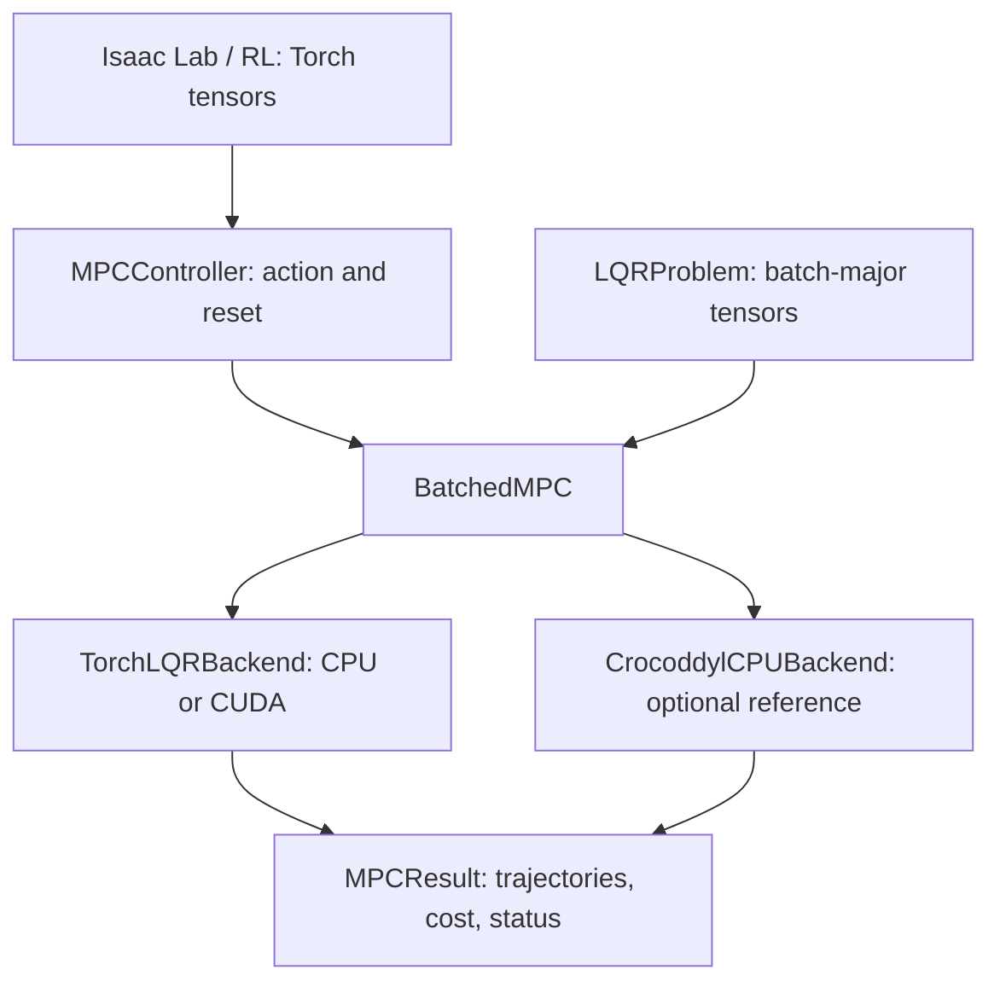

# 架构与接口契约

## 目标与边界

通过同一套 Torch 契约提供 CPU/GPU MPC。每批环境具有相同的维度与 horizon，
可以使用不同模型参数和代价权重。先建立 affine LQR 数值基线，再扩展机器人动力学与 DDP/FDDP。



上游 Crocoddyl 的 C++/Eigen 与 Python/NumPy 接口作为语义和数值参考。
GPU 路径独立实现批量计算，不在每个环境调用 Python Crocoddyl 对象。
当前不是任意 `ShootingProblem` 到 GPU 的自动转换器。

## 数学定义

```text
x[t+1] = A[t] x[t] + B[t] u[t] + f[t]
J = sum(t=0..T-1) [0.5 x[t]^T Q[t] x[t] + q[t]^T x[t]
                   + 0.5 u[t]^T R[t] u[t] + r[t]^T u[t]]
    + 0.5 x[T]^T Qf x[T] + qf^T x[T]
```

`Q/Qf` 要求对称半正定，`R` 要求对称正定。不支持状态控制交叉项、上下界或流形。
`regularization=λ` 在目标中加入 `0.5 λ ||u||²`，cost 包含该项；不是 DDP 自适应 damping。
跟踪参考可设 `q=-Q*xref`、`qf=-Qf*xref_T`。忽略常数不影响动作，但上述 cost 可为负。

## Tensor 契约

| 字段 | 形状 |
| --- | --- |
| `x0` | `[B, nx]` |
| `A`, `Q` | `[B, T, nx, nx]` |
| `B`（控制矩阵） | `[B, T, nx, nu]` |
| `R` | `[B, T, nu, nu]` |
| `Qf` | `[B, nx, nx]` |
| `f`, `q` | `[B, T, nx]` |
| `r` | `[B, T, nu]` |
| `qf` | `[B, nx]` |
| `result.xs` | `[B, T+1, nx]` |
| `result.us` | `[B, T, nu]` |
| `result.action` | `[B, nu]` |
| `result.cost/status/iterations` | `[B]` |

- 支持 float32/float64；输入共享 device/dtype，status/iterations 为 int64。
- 严格形状检查，不猜测 batch/time 维。`from_lti` 显式扩展二维共享矩阵。
- 接受非连续和 expand view。内部算子可能分配或整理临时空间，不承诺零分配/零拷贝。
- 模型 tensor 借用调用方存储，无隐式 `.to()`。冻结 dataclass 仅限制字段替换，
  内容仍可原地更新；不要修改展开 view。可用完整 tensor 或 `dataclasses.replace` 更新模型。
- 求解不修改输入；输出不会被下次求解覆盖。调用方负责存储存活、多线程和跨 stream 同步。
- 创建模型时校验形状；求解检查状态元数据和设备上的有限性/分解状态。
  不在热路径校验对称性或特征值，凸性与对称性是调用方的前置条件。

## 计算与失败

Torch 后端沿时间维 backward Riccati + forward rollout，环境维使用 batched 运算。
`cholesky_ex(check_errors=False)` 将分解状态留在设备，不用 CUDA tensor 的 Python
布尔值或 `.item()` 做求解分支。分解后使用两次 `solve_triangular`，避免当前 Torch 的
`cholesky_solve` 内部同步。仍有 Python 时间循环、完整轨迹/临时分配及每次模型有限性扫描。

使用 PyTorch current stream；同 stream 的生产者/消费者顺序调用。跨 stream 由调用方
设置 event/wait 并管理生命周期。基准在计时边界同步，求解器不调用 `cuda.synchronize()`。

| status | 语义 |
| --- | --- |
| `SUCCESS=0` | 求解完成且结果有限；满足前置条件时为该 LQR 最优解 |
| `NUMERICAL_FAILURE=1` | 输入非有限、分解失败或输出非有限 |
| `MAX_ITERATIONS=2` | Crocoddyl 在迭代预算内未收敛 |

失败环境 `xs/us/cost` 为 NaN，`result.action` 为零，其他环境独立。
`MPCController.compute` 失败时保持上次成功动作；`reset(bool[B])` 清除指定缓存，
`reset()` 清除全部。返回动作不暴露内部缓存。类型/形状/device 错误抛异常。
Torch `iterations=1` 表示一次精确递推，不能与 DDP 迭代计数作性能比较。

## Crocoddyl 与扩展

Crocoddyl 参考后端延迟导入依赖、显式拒绝 CUDA，每次逐环境重建 LQR shooting problem。
内部 NumPy/float64 转换有开销，输出还原输入 dtype。用于正确性对照，尚未优化批量 CPU 调度。

非线性阶段需要模型 `calc/calc_diff`、状态 `integrate/diff`、区分 `nx/ndx`、导数/workspace
契约以及逐环境线搜索/正则化。保留 `MPCBackend` 协议；暂不建立空的 C++/CUDA 编译层。
当前使用 `no_grad`，可作 RL controller/teacher，不支持穿过求解器学习参数。

## 一手资料

- [Crocoddyl overview / bindings](https://gepettoweb.laas.fr/doc/loco-3d/crocoddyl/devel/doxygen-html/)
- [ActionModelLQR 定义](https://gepettoweb.laas.fr/doc/loco-3d/crocoddyl/devel/doxygen-html/lqr_8hpp_source.html)
- [PyTorch Cholesky CUDA 同步说明](https://docs.pytorch.org/docs/main/generated/torch.linalg.cholesky.html)
- [Isaac Lab DirectRLEnv 教程](https://isaac-sim.github.io/IsaacLab/main/source/tutorials/03_envs/create_direct_rl_env.html)
